# management
学生信息管理系统


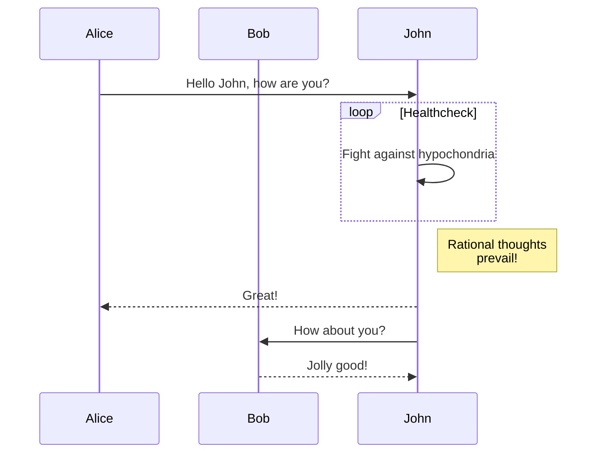

# JavaScript

```javascript
// Demo code (the actual new parser character stream implementation)

functio StringStream(string) {
  this.pos = 0;
  this.string = string;
}

StringStream.ototype = {
  done: function() {return this.pos >= this.string.length;},
  peek: function() {return this.string.charAt(this.pos);},
  next: function() {
    if (this.pos < this.string.length)
      return this.string.charAt(this.pos++);
  },
  eat: function(match) {
    var ch = this.string.charAt(this.pos);
    if (typeof match == "string") var ok = ch == match;
    else var ok = ch && match.test ? match.test(ch) : match(ch);
    if (ok) {this.pos++; return ch;}
  }
};
```

# typeScript

```typescript
class Greeter {
  greeting: string;
  constructor (message: string) {
    this.greeting = message;
  }
  greet() {
    return "Hello, " + this.greeting;
  }
}   

var greeter = new Greeter("world");

var button = document.createElement('button')
button.innerText = "Say Hello"
button.onclick = function() {
  alert(greeter.greet())
}

document.body.appendChild(button)
```

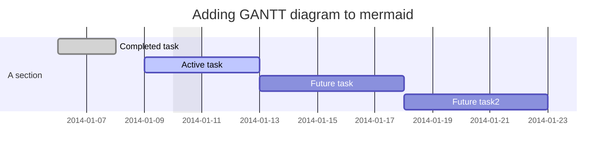

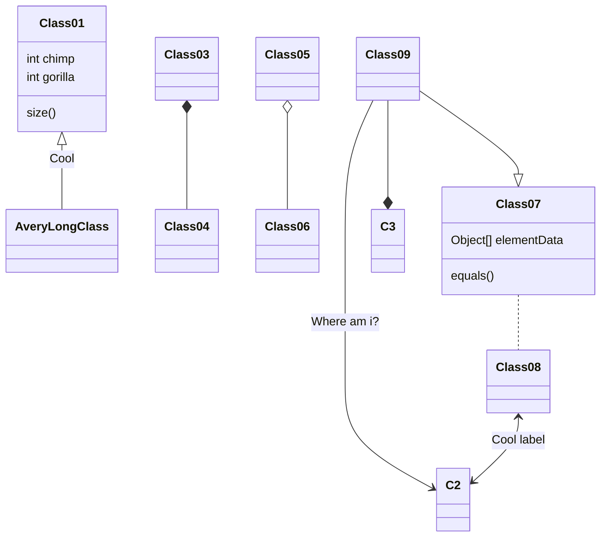

# Python
```python
#!/usr/bin/lgy
#-*-coding:utf-8-*-
 
import urllib2,threading
from PyQt4.QtGui import *
from time import time
 
# 暂时没用到 多线程任务下载用到
lock = threading.RLock()
 
class UpdateWidget(QWidget):
    def __init__(self,parent=None):
        super(UpdateWidget,self).__init__(parent)
        self.url = ""
        self.buffer = 10000
        self.start_size = 0
 
if __name__=='__main__':
    import sys
    app=QApplication(sys.argv)
    tree=UpdateWidget()
    tree.show()
    sys.exit(app.exec_())
```

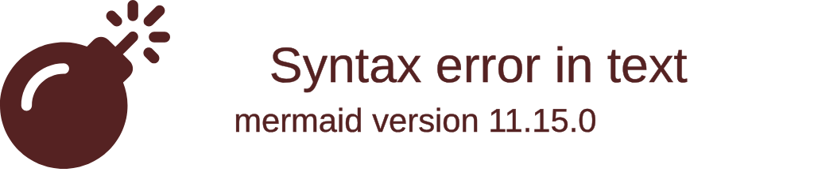

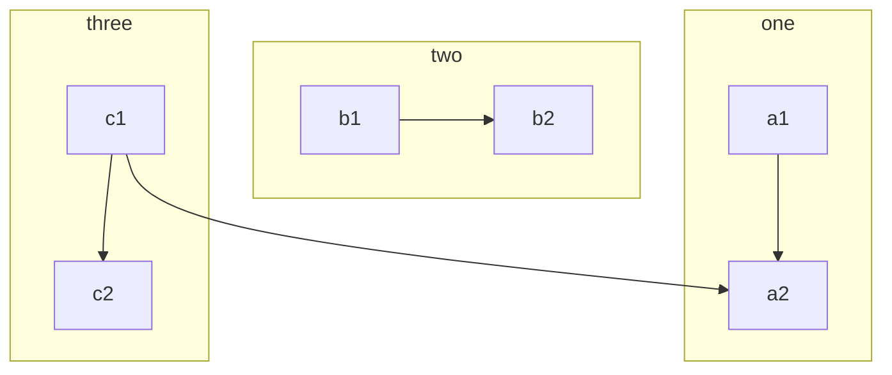

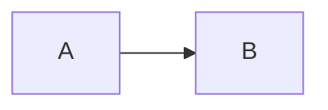

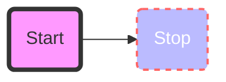

# Json
```json
{
  "@context": {
    "name": "http://schema.org/name",
    "description": "http://schema.org/description",
    "image": {
      "@id": "http://schema.org/image",
      "@type": "@id"
    },
    "geo": "http://schema.org/geo",
    "latitude": {
      "@id": "http://schema.org/latitude",
      "@type": "xsd:float"
    },
    "longitude": {
      "@id": "http://schema.org/longitude",
      "@type": "xsd:float"
    },
    "xsd": "http://www.w3.org/2001/XMLSchema#"
  },
  "name": "The Empire State Building",
  "description": "The Empire State Building is a 102-story landmark in New York City.",
  "image": "http://www.civil.usherbrooke.ca/cours/gci215a/empire-state-building.jpg",
  "geo": {
    "latitude": "40.75",
    "longitude": "73.98"
  }
}
```


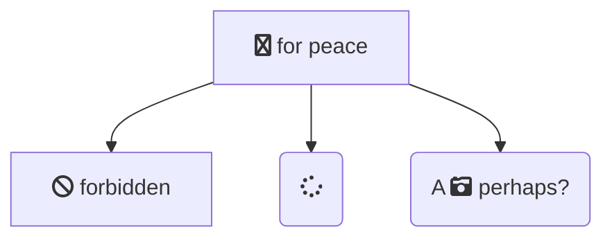

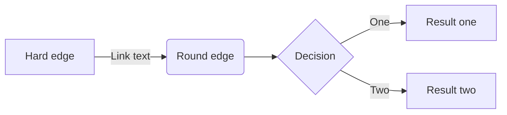

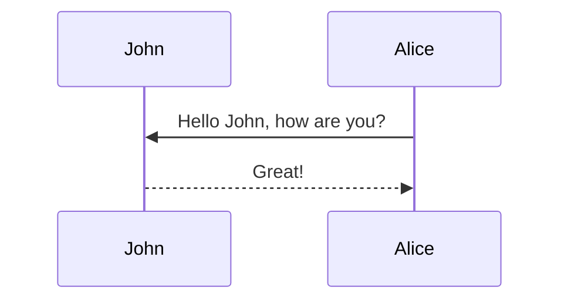

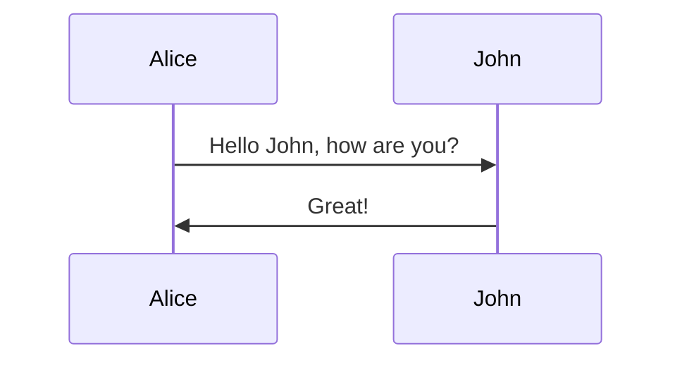

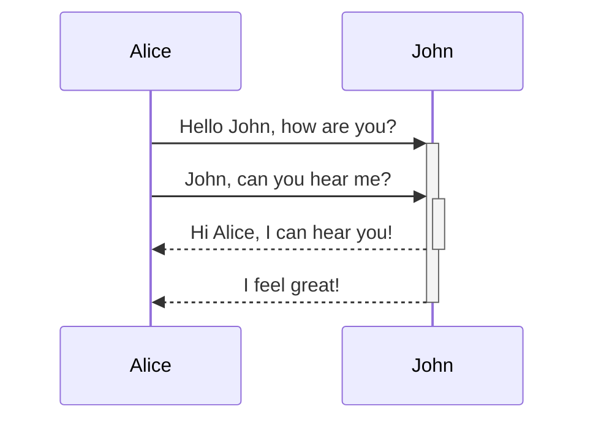

# gss
```gss
/* Some example Closure Stylesheets */

@provide 'some.styles';

@require 'other.styles';

@component {

@def FONT_FAMILY           "Times New Roman", Georgia, Serif;
@def FONT_SIZE_NORMAL      15px;
@def FONT_NORMAL           normal FONT_SIZE_NORMAL FONT_FAMILY;

@def BG_COLOR              rgb(235, 239, 249);

@def DIALOG_BORDER_COLOR   rgb(107, 144, 218);
@def DIALOG_BG_COLOR       BG_COLOR;

@def LEFT_HAND_NAV_WIDTH    180px;
@def LEFT_HAND_NAV_PADDING  3px;

@defmixin size(WIDTH, HEIGHT) {
  width: WIDTH;
  height: HEIGHT;
}

body {
  background-color: BG_COLOR;
  margin: 0;
  padding: 3em 6em;
  font: FONT_NORMAL;
  color: #000;
}
```

# css
```css
/* Some example CSS */

@import url("something.css");

body {
  margin: 0;
  padding: 3em 6em;
  font-family: tahoma, arial, sans-serif;
  color: #000;
}

#navigation a {
  font-weight: bold;
  text-decoration: none !important;
}
```


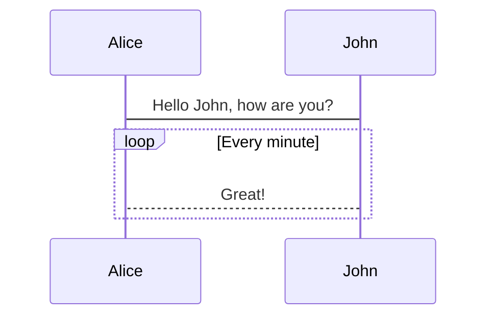
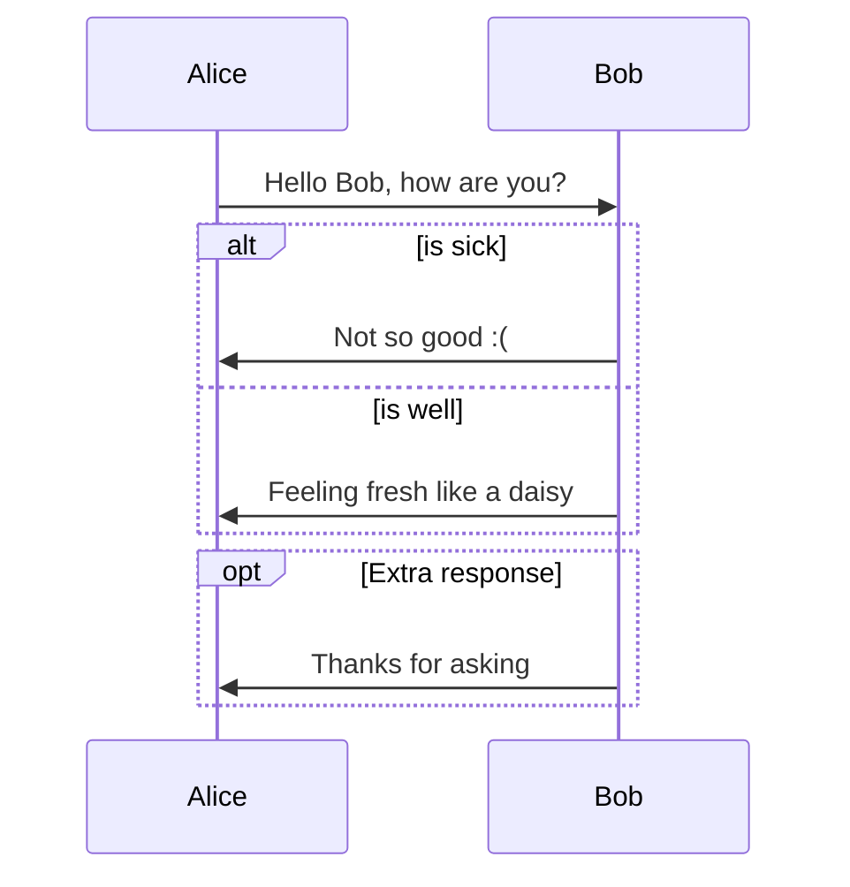

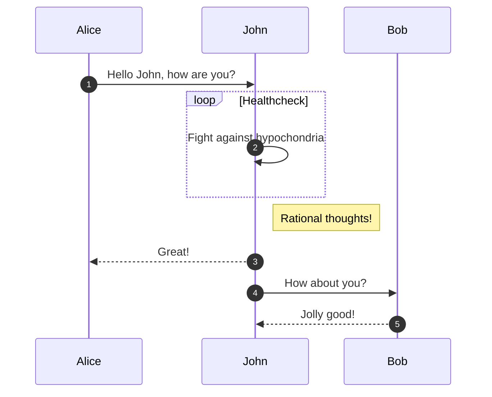

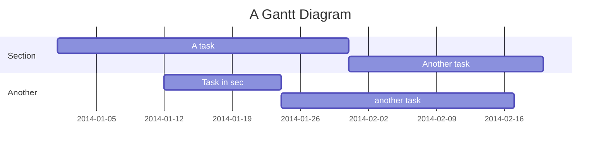

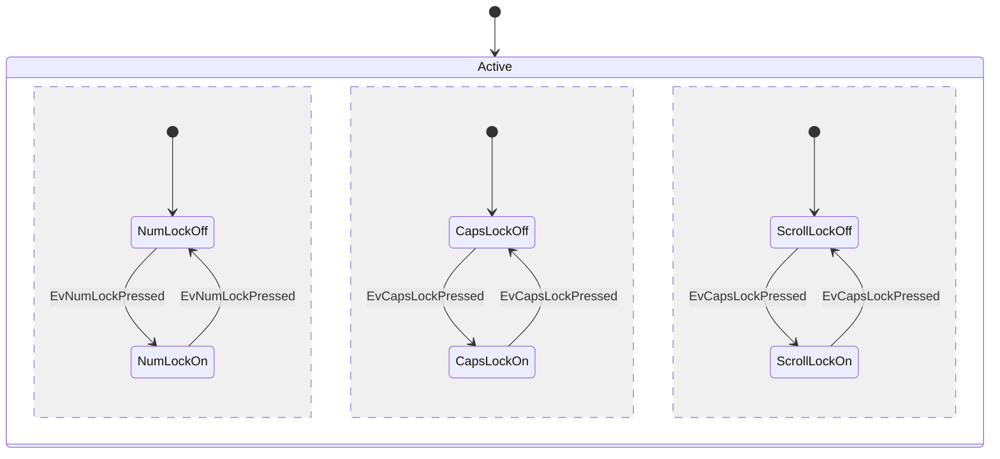
